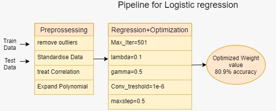

# ml-project-1-youphiggs

Files included:

1. `run.py`: main script, instruction please see below.
2. `implementations.py`: 6 basic ML methods to implement. Note that these methods are not used for project.
3. `proj1_helper.py`: helper functions provided at the begining of the project.
4. `utility.py`: all other methods used for project.

Instructions

- To run the run.py, the `train.csv` and `test.csv` files have to be in the same folder of the script.

- Run run.py with `python3 run.py` 

- The script will first do the exactly same preprocessing on the train set and test set.

- Then, the logistic regression will be trained with parameters: max_iter=501, lambda_=0.0, gamma=0.5, conv_threshold=1e-6, maxstep=0.5.

- Finally, the trained model will be evaluated with cross validation and prediction file is generated as `pred_best.csv` under the current folder.

A pipeline for the model building is as follows:

